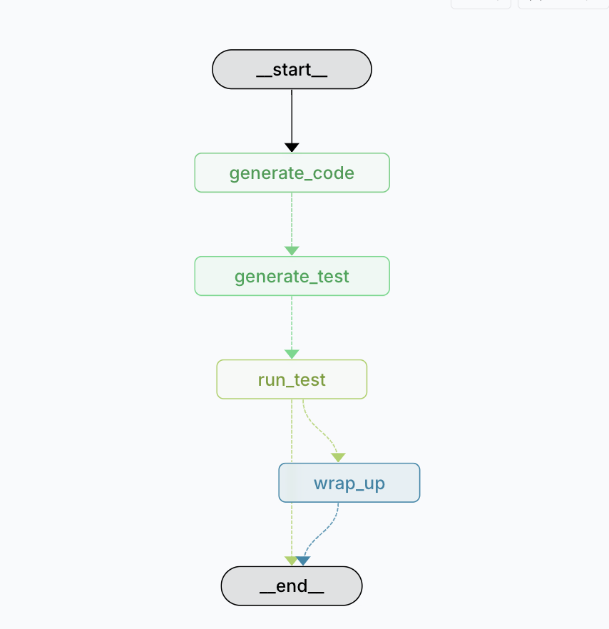

# LangGraph Coding Agent Workflow

A LangGraph-based workflow for automated code generation, testing, and execution. This project implements an agent workflow that can generate code, create tests, run them, and provide structured test reports.

## Workflow Architecture: Prompt Chaining

This project utilizes prompt chaining, where each LLM call processes the output of the previous one.

> Prompt chaining decomposes a task into a sequence of steps, where each LLM call processes the output of the previous one. You can add programmatic checks on any intermediate steps to ensure that the process is still on track.

### Why Prompt Chaining?

This workflow is ideal for situations where the task can be easily and cleanly decomposed into fixed subtasks. The main goal is to trade off latency for higher accuracy, by making each LLM call an easier task.

In our case, the workflow follows these steps:



The workflow consists of:

1. Code Generation (`generate_code.py`) - Creates the initial code implementation
2. Test Generation (`generate_test.py`) - Creates test cases based on the generated code
3. Test Execution (`run_test.py`) - Runs the tests and generates structured reports
4. Results Processing (`wrap_up.py`) - Processes and finalizes the results

Each step builds upon the output of the previous step, with programmatic checks in between to ensure quality and correctness. The graph shows the flow from start to end, with each node representing a processing step in our prompt chain.

### Example Workflow: Adding Two Numbers

Let's walk through a complete example of how our workflow processes a simple task:

#### 1. User Query

```
"I want a function to add two numbers"
```

#### 2. Generated Code

The system generates a type-annotated Python function:

```python
def add_two_numbers(a: int, b: int) -> int:
    return a + b
```

The generated code includes:

- Type hints for parameters and return value
- Clear, descriptive function name
- Simple, efficient implementation

#### 3. Generated Tests

The system generates comprehensive test cases to validate the function:

```json
{
  "function_name": "add_two_numbers",
  "tests": [
    { "args": [1, 2], "kwargs": {}, "expect": 3 },
    { "args": [0, 0], "kwargs": {}, "expect": 0 },
    { "args": [-5, 2], "kwargs": {}, "expect": -3 },
    { "args": [100, 200], "kwargs": {}, "expect": 300 },
    { "args": [2147483647, 1], "kwargs": {}, "expect": 2147483648 }
  ]
}
```

The test cases cover:

- Basic addition (1 + 2)
- Zero handling (0 + 0)
- Negative numbers (-5 + 2)
- Larger numbers (100 + 200)
- Edge cases (MAX_INT + 1)

#### 4. Test Execution Results

The system runs the tests and produces a structured JSON report:

```json
{
  "results": [],
  "logs": {
    "stdout": [
      {
        "cases": [
          {
            "args": [1, 2],
            "kwargs": {},
            "expect": 3,
            "result": 3,
            "ok": true
          },
          {
            "args": [0, 0],
            "kwargs": {},
            "expect": 0,
            "result": 0,
            "ok": true
          },
          {
            "args": [-5, 2],
            "kwargs": {},
            "expect": -3,
            "result": -3,
            "ok": true
          },
          {
            "args": [100, 200],
            "kwargs": {},
            "expect": 300,
            "result": 300,
            "ok": true
          },
          {
            "args": [2147483647, 1],
            "kwargs": {},
            "expect": 2147483648,
            "result": 2147483648,
            "ok": true
          }
        ]
      }
    ],
    "stderr": [],
    "error": null
  }
}
```

The report shows:

- All test cases passed (`"ok": true`)
- No errors occurred (`"error": null`)
- No stderr output (`"stderr": []`)
- Structured test results in stdout

### Real-World Prompt Chaining Examples

Here are some examples of how prompt chaining can be applied in various domains:

#### 1. Customer Support Email Drafting

1. Extract intent from the customer's email
2. Classify urgency (gate: high vs low)
3. Draft a polite response
4. Check response length and tone (gate: too long/too harsh)
5. Refine for clarity

✅ **Why chaining?** Breaking this down ensures every email is on-brand and safe before sending.

#### 2. Job Application Screening

1. Extract key info from CV (skills, experience, education)
2. Match against job requirements
3. Gate: if missing critical skills → reject with explanation
4. Summarize candidate fit
5. Draft interview questions based on gaps

✅ **Why chaining?** Hiring managers can get structured, bias-checked outputs instead of one messy "evaluate this CV" call.

#### 3. Research & Writing Assistant

1. Generate an outline for a blog post or paper
2. Gate: check outline coverage against a checklist
3. Expand into draft sections
4. Gate: check word count or fact coverage
5. Refine for tone, readability, and SEO

✅ **Why chaining?** Helps content teams maintain consistent structure and quality.

#### 4. Medical Triage Assistant (non-diagnostic, supportive tool)

1. Extract symptoms from patient description
2. Normalize into medical terms
3. Gate: check if any "red flag" symptoms → escalate immediately
4. Suggest possible next steps (e.g., book appointment, self-care tips)

✅ **Why chaining?** Keeps patient safe by inserting a critical safety gate step.

#### 5. Financial Document Processing

1. OCR + extract transaction data
2. Classify into categories (income, expense, asset)
3. Gate: check for missing/invalid entries
4. Generate monthly summary report
5. Create data visualization

✅ **Why chaining?** Ensures clean, validated financial data before final reporting.

#### 6. Game Design Helper

1. Generate a character concept
2. Gate: check if concept has required traits (backstory, skills)
3. Flesh out dialogue or questlines
4. Add world-building connections
5. Polish description for lore consistency

✅ **Why chaining?** Makes creative outputs structured and reusable.

## Getting Started

### Prerequisites

- Python 3.8 or higher
- pip (Python package installer)
- git

### Clone the Repository

```bash
# Clone the repository
git clone https://github.com/jameskanyiri/Langgraph_conding_agent.git

# Navigate to the project directory
cd Langgraph_conding_agent

#Create virtual environment
uv venv

#sync dependancies
uv sync
```

## Development

The workflow consists of several nodes:

- `generate_code.py`: Generates code based on requirements
- `generate_test.py`: Creates test cases for the generated code
- `run_test.py`: Executes tests and generates structured reports
- `wrap_up.py`: Handles final results and cleanup

Each node maintains its state through the `AgentState` class defined in `state.py`.
